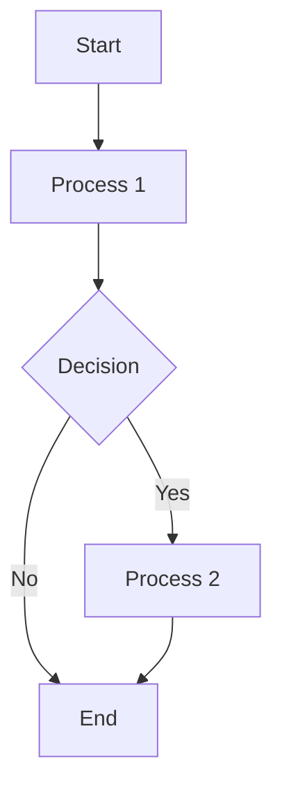

# Project Title

A brief description of what this project does and who it's for.

## Installation

Instructions on how to install and set up the project.

```bash
pip install project-name
```

## Usage

Examples of how to use the project.

```python
import project_name

# Example usage
project_name.do_something()
```

## Flow Diagram

Below is a flow diagram illustrating the process flow of the project.



## Contributing

Guidelines for contributing to the project.

## License

Information about the project's license.

## Additional Documentation

You can import other markdown files using the following syntax:

```markdown
[Link to another markdown file](another-file.md)
```